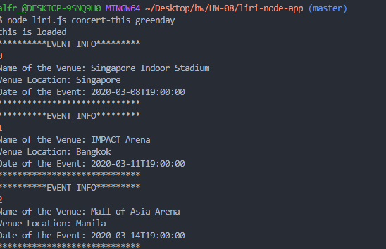
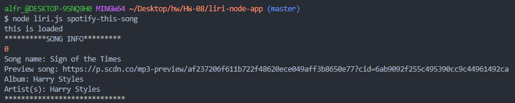
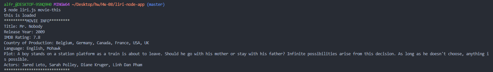
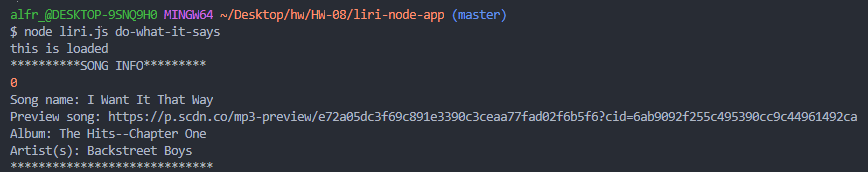

# liri-node-app

With this app you will be able to mock some of the functions of siri, with in the command line of a terminal using node.js
to use the app you have to feed it one of four command
1. concert-this(artist name) with this command you will be able to find concerts of that band
2. spotify-this-song(song name) with this command you will get the songs information along with a preview url
3.  movie-this(name of movie) with this command you will get movies information
4. do-what-it-says with this command it will run a set of instructions built into the code

*****************************************************************************************************************************************************************************
examples if it being used 
*****************************************************************************************************************************************************************************

******************************************************************concert-this***********************************************************************************************

*****************************************************************************************************************************************************************************

******************************************************************spotify-this-song******************************************************************************************

*****************************************************************************************************************************************************************************

******************************************************************movie-this***********************************************************************************************

*****************************************************************************************************************************************************************************

******************************************************************do-what-it-says********************************************************************************************

*****************************************************************************************************************************************************************************

